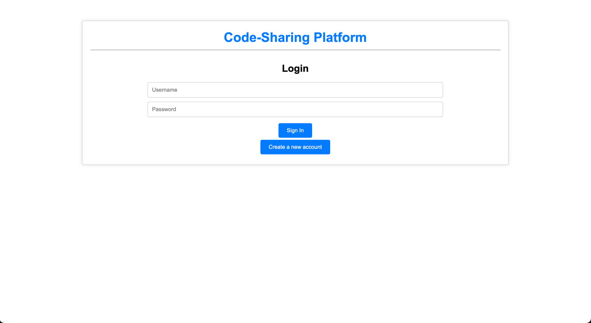
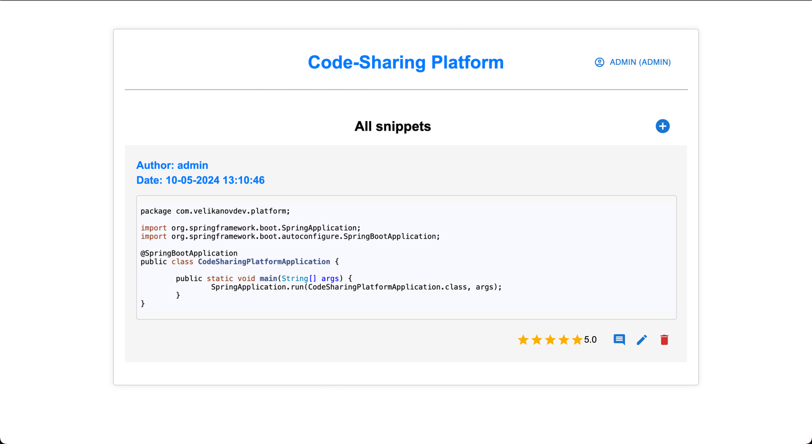
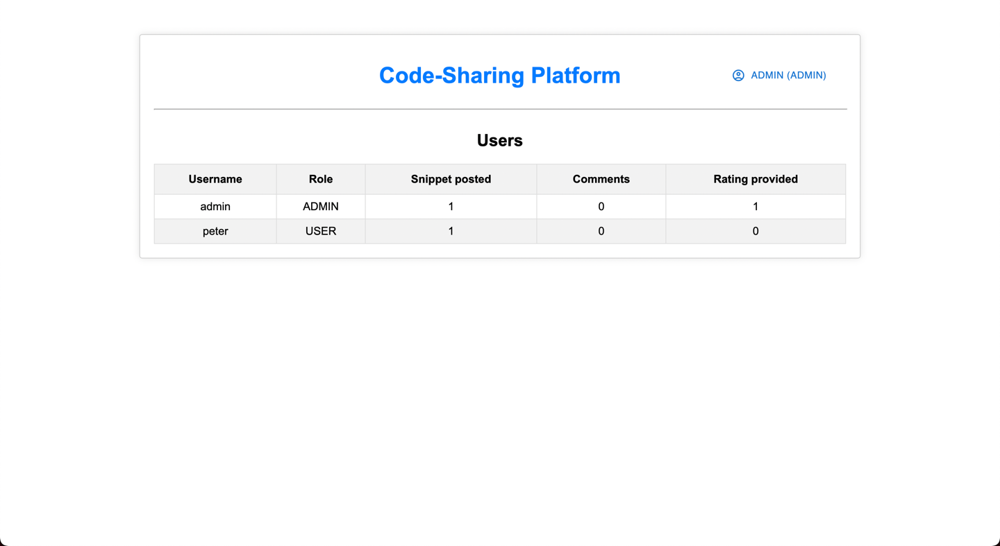

# Code-sharing Platform

This project is a comprehensive code-sharing platform where users can post, edit, and delete code snippets. It features a React-based frontend and a Java Spring Boot backend, leveraging PostgreSQL as the database. The project supports user authentication, commenting, and rating of code snippets, along with administrative controls.

## Features

- User registration and authentication.
- Posting, editing, and deleting code snippets.
- Commenting on and rating snippets.
- Admin management for user roles.
- Responsive frontend design using React.

## Technologies Used
This project utilizes a range of technologies to provide robust and scalable code-sharing functionality:

### Backend

- **Java 17**: Programming language.
- **Spring Boot**: Application framework used to simplify the development of new Spring applications.
- **Maven**: Dependency management and project build tool.
- **PostgreSQL**: The database for storing all application data.
- **Spring Data JPA**: Simplifies data access operations.
- **Spring Security**: For authentication and access control.
- **JUnit & Mockito**: For unit and integration tests.
- **Swagger**: API documentation.

### Frontend

- **React**: JavaScript library for building user interfaces.
- **axios**: Promise based HTTP client for making requests to the backend.
- **Material-UI**: UI framework for implementing Google's Material Design.
- **react-router-dom**: Routing library for navigating between views.


## Prerequisites

Before you begin, ensure you have met the following requirements:
- JDK 17 or higher for the backend.
- Node.js 14 or higher and npm for the frontend.
- PostgreSQL 13 or higher.
- Maven 3.6 or higher for building the backend.

## Setup

To get a local copy up and running follow these simple steps:

### Database Setup

1. Install PostgreSQL and create a database named `platform`.
2. Adjust the `src/main/resources/application.properties` file with your PostgreSQL username and password.

### Backend Setup

1. Clone the repository:
   ```bash
   git clone https://github.com/VelikanovDev/Code-Sharing-Platform.git
   cd Code-Sharing Platform
   ```
   
2. Build the project:

    ```bash
   cd backend
   mvn clean install
   ```
   
3. Run the application:
    ```bash
   mvn spring-boot:run
    ```

The backend should be running on http://localhost:8080.

### Frontend Setup
1. Navigate to the frontend directory:
    ```bash
    cd Code-Sharing Platform/frontend
    ```

2. Install NPM packages:
   ```bash
   npm install
   ```
   
3. Start the React application:
   ```bash
   npm start
   ```
The frontend should be available on http://localhost:3000.

## API Documentation

After running the application, you can access the API documentation at http://localhost:8080/swagger-ui/index.html#/snippet-controller. This page will provide you with all the available RESTful endpoints along with their specifications.



